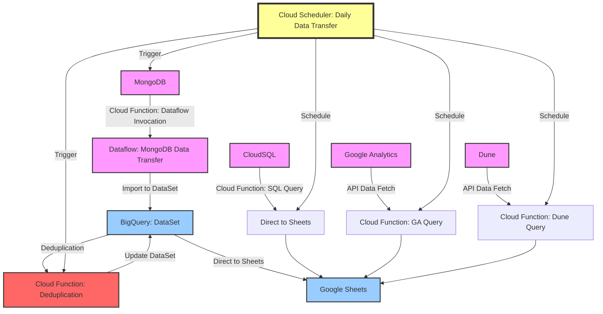

# 🚀 Project Overview

This project integrates various data sources with Google Sheets and BigQuery using Cloud Functions. It is structured to handle different data processing and transfer needs efficiently.

 

## Data Architecture

- https://mermaid.live/edit

 

## 📁 File Structure

- **📜 LICENSE**: Contains the MIT License details for this project.
- **📄 README.md**: This file.
- **🔑 key**
  - `terraform.json` - Stores the Terraform configuration key.
- **📦 modules**: Terraform modules for different infrastructure components.
  - **🌐 gcs_buckets**
    - Management of Google Cloud Storage buckets.
  - **🗄️ mysql**
    - Manages MySQL configurations, including read replicas.
  - **🌍 network**
    - Network configurations and related components like firewall rules and subnets.
  - **🔐 service_accounts**
    - Manages service accounts configurations.
- **🔧 project/somaz-bigquery**: Contains Cloud Functions for data processing and transfer.
  - **📈 analytics-to-sheet-new-web-visitors**
    - Retrieves new web visitors count from Google Analytics and inputs it into Google Sheets.
  - **🌏 analytics-to-sheet-new-web-visitors-country**
    - Fetches country-wise new web visitor counts from Google Analytics for input into Google Sheets.
  - **🔄 bigquery-deduplication**
    - Removes duplicate data entries in BigQuery imported from MongoDB.
  - **📊 bigquery-to-sheet-multiple/simple/retention/wallet**
    - Functions for querying data from BigQuery and exporting to Google Sheets.
  - **📋 copy-formula-to-sheet**
    - Copies cells with formulas in Google Sheets.
  - **📋 copy-formula-monthly-to-sheet**
    - Copies cells with formulas in Google Sheets.
  - **💱 matic-value-to-sheet**
    - Fetches the daily price of Matic from [CoinGecko](https://www.coingecko.com/ko/%EC%BD%94%EC%9D%B8/polygon/historical_data#panel) and inputs it into Google Sheets.
  - **🔄 mongodb-to-bigquery**
    - Transforms data from MongoDB for export to BigQuery.
  - **🌐 onchain-agent-common-to-sheet**
    - Imports Onchain data from Dune API to Google Sheets.
  - **🌐 onchain-agent-epic-to-sheet**
    - Imports Onchain data from Dune API to Google Sheets.
  - **🌐 onchain-agent-legend-to-sheet**
    - Imports Onchain data from Dune API to Google Sheets.
  - **🌐 onchain-agent-rare-to-sheet**
    - Imports Onchain data from Dune API to Google Sheets.
  - **🌐 onchain-agent-uncommon-to-sheet**
    - Imports Onchain data from Dune API to Google Sheets.
  - **🌐 onchain-materials-dp-chip-to-sheet**
    - Imports Onchain data from Dune API to Google Sheets.
  - **🌐 onchain-materials-skill-exchange-ticket-to-sheet**
    - Imports Onchain data from Dune API to Google Sheets.
  - **🌐 onchain-pack-basic-epic1-to-sheet**
    - Imports Onchain data from Dune API to Google Sheets.
  - **🌐 onchain-quest2-daily-global-to-sheet**
    - Imports Onchain data from Dune API to Google Sheets.
  ...

 

## ⚠️ Cautionary Notes

- **🔐 Service Accounts**: Only Service Accounts from your project can be used with Cloud Functions and Cloud Scheduler.
- **🔗 API Usage**: 
  - For GA4, the [Analytics Reporting API](https://console.cloud.google.com/apis/api/analyticsreporting.googleapis.com/overview?hl=ko&project=mgmt-2023&supportedpurview=project) is not available.
  - However, the [Google Analytics Data API](https://console.cloud.google.com/apis/api/analyticsdata.googleapis.com/overview?hl=ko&project=mgmt-2023&supportedpurview=project) can be used.
  - To use the [Dune API](https://dune.com/docs/api/) for Onchain data, you will need to create an API Key and choose an appropriate billing plan.

 

## 📜 License

This project is licensed under the MIT License - see the [LICENSE](LICENSE) file for details.
