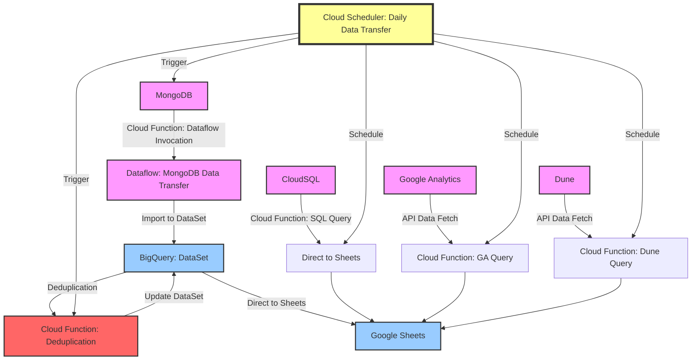

# Terraform BigQuery & Google Sheets Pipeline

This project integrates various data sources with Google Sheets and BigQuery using Cloud Functions. It is structured to handle different data processing and transfer needs efficiently.

<br/>

## Data Architecture


```mermaid
graph TD
    A[MongoDB] -->|Cloud Function: Dataflow Invocation| B[Dataflow: MongoDB Data Transfer]
    B -->|Import to DataSet| I[BigQuery: DataSet]
    I -->|Deduplication| P[Cloud Function: Deduplication]
    P -->|Update DataSet| I
    I -->|Direct to Sheets| K[Google Sheets]
    C[CloudSQL] -->|Cloud Function: SQL Query| D[Direct to Sheets]
    D --> K
    E[Google Analytics] -->|API Data Fetch| F[Cloud Function: GA Query]
    F --> K
    G[Dune] -->|API Data Fetch| H[Cloud Function: Dune Query]
    H --> K
    L[Cloud Scheduler: Daily Data Transfer] -->|Trigger| A
    L -->|Trigger| P
    L -->|Schedule| D
    L -->|Schedule| F
    L -->|Schedule| H

    style A fill:#f9f,stroke:#333,stroke-width:2px
    style B fill:#f9f,stroke:#333,stroke-width:2px
    style C fill:#f9f,stroke:#333,stroke-width:2px
    style E fill:#f9f,stroke:#333,stroke-width:2px
    style G fill:#f9f,stroke:#333,stroke-width:2px
    style I fill:#9cf,stroke:#333,stroke-width:2px
    style K fill:#9cf,stroke:#333,stroke-width:2px
    style L fill:#ff9,stroke:#333,stroke-width:4px
    style P fill:#f66,stroke:#333,stroke-width:2px
```

- https://mermaid.live/edit

<br/>

## Prerequisites

- [Terraform](https://www.terraform.io/downloads) >= 1.0
- [Google Cloud SDK](https://cloud.google.com/sdk/docs/install)
- GCP project with billing enabled
- Service Account key (`key/terraform.json`)

<br/>

## Getting Started

```bash
# 1. Clone the repository
git clone <repo-url>
cd terraform-bigquery-googlesheet

# 2. Navigate to the project directory
cd project/somaz-bigquery

# 3. Set sensitive variables (do NOT commit real values)
export TF_VAR_db_admin_password="your-secure-password"

# 4. Initialize Terraform
terraform init

# 5. Review and apply
terraform plan -var-file=somaz.tfvars
terraform apply -var-file=somaz.tfvars
```

<br/>

## Project Structure

```
terraform-bigquery-googlesheet/
├── key/                          # Service account credentials (do NOT commit secrets)
├── modules/                      # Reusable Terraform modules
│   ├── gcs_buckets/              # Google Cloud Storage buckets
│   ├── mysql/                    # CloudSQL (MySQL) configuration
│   ├── network/                  # VPC, subnets, firewall rules
│   └── service_accounts/         # GCP service accounts
└── project/somaz-bigquery/       # Main Terraform configuration
    ├── *.tf                      # Terraform resource definitions
    ├── somaz.tfvars              # Variable overrides
    └── cloud-functions/          # 28 Cloud Function implementations
```

<br/>

## Cloud Functions

### BigQuery to Sheets

| Function | Description |
|----------|-------------|
| `bigquery-to-sheet-simple` | Basic BigQuery to Sheets export |
| `bigquery-to-sheet-multiple` | Multiple table queries to Sheets |
| `bigquery-to-sheet-retention` | Retention metrics export |
| `bigquery-to-sheet-wallet` | Wallet/balance data export |
| `bigquery-to-sheet-tier-badge-monthly` | Monthly tier badge metrics |

<br/>

### Data Pipeline

| Function | Description |
|----------|-------------|
| `mongodb-to-bigquery` | MongoDB import via Dataflow |
| `bigquery-deduplication` | Remove duplicate records in BigQuery |
| `somaz-cdn-bucket-file-download` | CDN log processing and download |

<br/>

### Google Analytics

| Function | Description |
|----------|-------------|
| `analytics-to-sheet-new-web-visitors` | GA4 new user metrics to Sheets |
| `analytics-to-sheet-new-web-visitors-country` | GA4 by country to Sheets |

<br/>

### Formula Copy

| Function | Description |
|----------|-------------|
| `copy-formula-to-sheet` | Copy formulas in Google Sheets |
| `copy-formula-monthly-to-sheet` | Monthly formula copies |
| `copy-formula-retention-to-sheet` | Retention formula copies |

<br/>

### Onchain (Dune API)

| Function | Description |
|----------|-------------|
| `onchain-agent-{common,epic,legend,rare,uncommon}-to-sheet` | Agent data by rarity |
| `onchain-materials-dp-chip-to-sheet` | DP Chip materials data |
| `onchain-materials-skill-exchange-ticket-to-sheet` | Skill exchange ticket data |
| `onchain-pack-basic-epic1-to-sheet` | Pack (basic/epic) data |
| `onchain-pack-airdrop-monthly-to-sheet` | Monthly airdrop pack data |
| `onchain-pack-contribution-compensation-monthly-to-sheet` | Monthly contribution compensation |
| `onchain-quest2-daily-global-to-sheet` | Daily global quest data |
| `onchain-quest2-daily-global-monthly-to-sheet` | Monthly aggregated quest data |
| `onchain-quest2-premium-monthly-to-sheet` | Premium quest monthly data |
| `onchain-quest2-weekly-monthly-to-sheet` | Weekly quest monthly data |

<br/>

### Other

| Function | Description |
|----------|-------------|
| `matic-value-to-sheet` | Fetch Polygon (MATIC) price from CoinGecko |

<br/>

## Environment Variables

Cloud Functions use the following environment variables (set in Terraform `.tf` files):

| Variable | Description |
|----------|-------------|
| `SHEET_ID` | Google Sheet ID for data export |
| `DUNE_API_KEY` | Dune Analytics API key (for onchain functions) |
| `MONGODB_URI` | MongoDB connection string (for mongodb-to-bigquery) |
| `PROJECT_ID` | GCP project ID |
| `REGION` | GCP region |

<br/>

## Cautionary Notes

- **Service Accounts**: Only Service Accounts from your project can be used with Cloud Functions and Cloud Scheduler.
- **API Usage**:
  - For GA4, the [Analytics Reporting API](https://console.cloud.google.com/apis/api/analyticsreporting.googleapis.com/overview) is not available.
  - However, the [Google Analytics Data API](https://console.cloud.google.com/apis/api/analyticsdata.googleapis.com/overview) can be used.
  - To use the [Dune API](https://dune.com/docs/api/) for Onchain data, you will need to create an API Key and choose an appropriate billing plan.

<br/>

## License

This project is licensed under the MIT License - see the [LICENSE](LICENSE) file for details.
